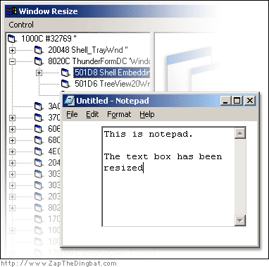



## Resize a diffrent applications controls

### Description

* Fixed Int/Long problems

This application allows you to resize another application's components.

Using the API it sets the border of a control so it can be dragged with the mouse. allowing you to change the layout of any application you like!
 
### More Info
 

             |
---                |---
**Submitted On**   |2002-09-24 20:52:40
**By**             |[Zap The Dingbat](https://github.com/Planet-Source-Code/PSCIndex/blob/master/ByAuthor/zap-the-dingbat.md)
**Level**          |Advanced
**User Rating**    |5.0 (40 globes from 8 users)
**Compatibility**  |VB 4\.0 \(32\-bit\), VB 5\.0, VB 6\.0
**Category**       |[Windows API Call/ Explanation](https://github.com/Planet-Source-Code/PSCIndex/blob/master/ByCategory/windows-api-call-explanation__1-39.md)
**World**          |[Visual Basic](https://github.com/Planet-Source-Code/PSCIndex/blob/master/ByWorld/visual-basic.md)
**Archive File**   |[Resize\_a\_d1366049262002\.zip](https://github.com/Planet-Source-Code/zap-the-dingbat-resize-a-diffrent-applications-controls__1-39236/archive/master.zip)

